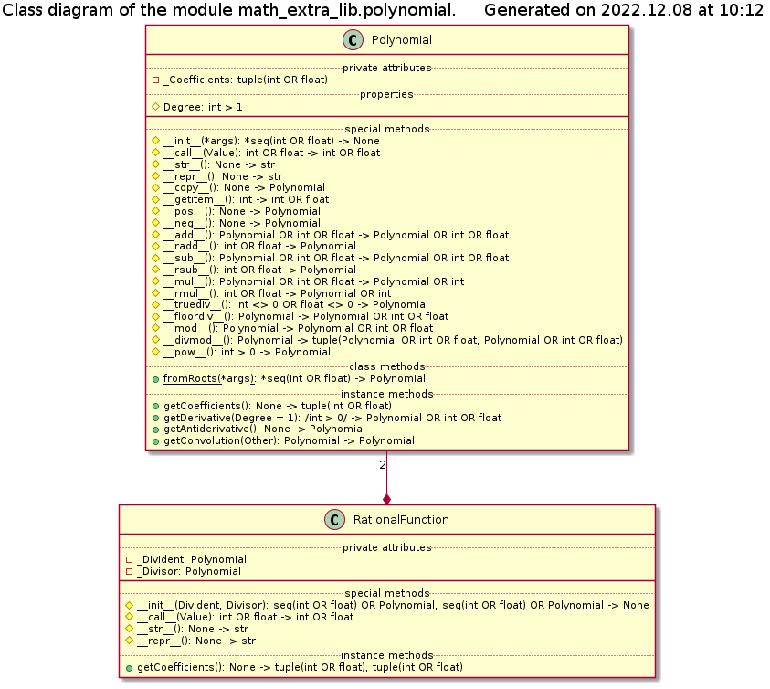

# Module math_extra_lib Reference

## Scope

This document describes the intended usage, design and implementation of the functionality implemented in the module **polynomial** of the library **math\_extra\_lib**. The API reference is also provided.

The functional objects covered in this document are:

* class **Polynomial**
* class **RationalFunction**

## Intended Use and Functionality

This module defines classes implementing a *polynomial* and a *rational function* (see [DE001](../Design/DE001_polynomials.md) document).

## Design and Implementation

The class diagram of the module is shown below:

The polynomial coefficients are passed during the instantiation of the **Polynomial** class, and are stored in 'private' instance attribute. The order of the arguments is from the free one (zero-th power) to the highest, N-th power coefficient. Powers not present in the polynomials must be passed as zero-valued arguments, whereas the last argument MUST be non-zero, since it defines the polynomial`s degree. Furthermore, at least 2 arguments must be passed (N >= 1).

Note that the terms with the zero coefficients are not included into the human readable representation of the object (implicit or explicit *str*() call), but are listed amongst the stored coefficients in the result of implicit or explicit *repr*() call.

The values of the coefficients can be viewed individually using standard indexing notation (but not slices!), but they cannot be modified. Alternatively, all coefficients can be obtained simultaneously via method *getCoefficients*().

Polynomial class implements the arithmetical operations using per-element addition, substraction, multiplication or division on sequences representing the polynomial coefficients, exactly as described in the [DE001](../Design/DE001_polynomials.md) document. The compatibility with the standard Python notation (usage of the standard operators) is achieved by defining the respective 'magic' methods.

The same approach is used for the calculation of the derivatives and the anti-derivative (indefinite integral). However, in the case of the calculation of a convolution of two polynomials the inner polynomial is exponentiated explicitely, using its own 'magic' method, and the produced terms are weigthed with the respective coefficients of the outer polymonial and summed up. Note that this functionality is implemented as *instance methods*, which should be called explicitely.

Since the class defines the 'magic' method *\_\_call\_\_*() its instance is callable, i.e. can be used as a function, wich evaluates the value of the polynomial at the given value of its argument.

The class **RationalFunction** must be instantiated with two arguments representing the divident and the divisor polynomials. Each of the arguments may be either an instance of **Polynomial** class or a sequence of, at least, two or more real numbers, with the last one being of non-zero value. In any case two new instances of the **Polynomial** class are created and stored as 'private' instance attributes.

All coefficients can be obtained simultaneously via method *getCoefficients*().

The *str*() representation of an instance is a ratio of the *str*() representations of the respective polynomials - i.e. terms with zero coefficients are not shown; whereas the *repr*() representation shows two tuples representing all coefficients of the respective polynomials.

Since the class defines the 'magic' method *\_\_call\_\_*() its instance is callable, i.e. can be used as a function, wich evaluates the value of the respective rational function at the given value of its argument.

As discussed in the [DE001](../Design/DE001_polynomials.md) document the zero by zero division is resolved using L`Hospital rule; however, few modifications are added in order to improve the numerical stability of the algorithm.

* The checks are made not on divisor being strictly zero, but if its absolute value is below 1E-8
* If the divident evaluates to the absolute value exceeding 1E-8, whereas the absolute value of the divisor is below 1E-12 - the situation is treated as singularity, i.e. division by zero - an exception is raised
* Otherwise, the rule is applied recursively (higher order derivatives are calculated in each step) until either divident or divisor evaluates to an absolute value above 1E-8
  * both divident and divisor values are above threshold - their ratio is returned
  * only divisor value is above the threshold - their ratio is returned
  * only divident is above the threshold - singularity, exception is raised

Both classes perform input data sanity check and raise the following exceptions (defined in the library *introspection\_lib*)

* **UT_TypeError** - sub-class of the standard **TypeError** with added introspection functionality; raised when
  * method argument or arithmetics operand is of improper data type
  * polynomial coefficient is accessed with improper indexing type (anything but integer)
* **UT_ValueError** - sub-class of the standard **ValueError** with added introspection functionality; raised when
  * number of arguments / items in a sequence defining a polynomial is less than 2
  * the last argument / item in a sequence defining a polynomial has zero value
  * polynomial coefficient is accessed with an integer index but with the value outside the acceptable range, defined by the number of the coefficients stored
  * division of a polynomial by zero
  * raising polynomial to zero or negative integer power
  * requesting zero-th or negative integer order derivative of a polynomial
  * a rational function has a singularity point at the given value of the argument

## API Reference

### Class Polynomial

Implementation of a polynomial. This class must be instantiated with an unpacked sequence of real numbers, which will be set as the coefficients from the zero-th to the highest power. The last positional argument of the initialization method must be non-zero.

An instance of this class supports index access to the individual coefficients (read only) and arithmetical operations with a real number or another polynomial.

An instance is also callable returning the value of the polynomial at the passed value of the argument.

__*Instantiation*__:

\_\_**init**\_\_(*args)

*Signature*:

**\*seq**(**int** OR **float**) -> **None**

*Args*:

*\*args*: **\*seq**(**int** OR **float**); any number of integer or floating point arguments

*Raises*:

* **UT_TypeError**: any of the arguments is not a real number
* **UT_ValueError**: number of arguments is less than 2, OR the last argument is zero

*Description*:

Stores the passed coefficients in an internal state. All passed arguments must be real numbers, which are treated as the polynomial coefficients sorted in the ascending order of the power. The last positional argument must be non-zero.

__*Attributes*__:

*Degree*: read-only property, **int** >= 1 - the degree of the polynomial

__*Class methods*__:

**fromRoots**(*args)

*Signature*:

**\*seq**(**int** OR **float**) -> **None**

*Args*:

*\*args*: **\*seq**(**int** OR **float**); any number of integer or floating point arguments

*Raises*:

* **UT_TypeError**: any of the arguments is not a real number
* **UT_ValueError**: no arguments are passed

*Description*:

Creates a polynomial from its roots, i.e. performs the inverse of the factorization: (x-x_1)\*...\*(x-x_N) -> a_0 + a_1 \* x + a_2 \* x^2 + ... + a_N * x^N.

__*Methods*__:

**getCoefficients()**

*Signature*:

**None** -> **tuple**(**int** OR **float**)

*Returns*:

**tuple**(**int** OR **float**): the coefficients from the zero-th towards the highest power

*Description*:

Method to access the values of the polynomial coefficients.

**getDerivative**(Degree = 1)

*Signature*:

/**int** >= 1/ -> **Polynomial** OR **int** OR **float**

*Args*:

*Degree*: (optional) **int** >= 1; degree of the derivative, defaults to 1

*Returns*:

* **Polynomial**: instance of, the K-th derivative for K < N
* **int** OR **float**: the K-th derivative for K >= N, which is strictly zero for K > N

*Raises*:

* **UT_TypeError**: passed argument is not an integer
* **UT_ValueError**: passed argument is zero or negative

*Description*:

Calculates the K-th (K >= 1) derivative of the polynomial of degree N.

**getAntiderivative**()

*Signature*:

**None** -> **Polynomial**

*Description*:

Calculates the first antiderivate (primitive function / indefinte integral) of the polynomial, with the integeration constant (free coefficient) being set to zero.

**getConvolution**(Other)

*Signature*:

**Polynomial** -> **Polynomial**

*Args*:

*Other*: **Polynomial**; instance of, the second (inner) polynomial to be used as the argument of the current one

*Raises*:

**UT_TypeError**: argument is not a polynomial

*Description*:

Calculates the convolution P(Q(x)) of two polynomials P(x) and Q(x), where P(x) is the current polynomial instance, and Q(x) is the passed polynomial.

### Class RationalFunction

Implementation of a rational function, i.e. a ratio of two polynomials. This class must be instantiated with two arguments representing the divident and the divisor polynomials, with either or both being an instance of the **Polynomial** class or a sequence of real numbers as the respective coefficients from the zer0-th to the highest power.

An instance is also callable returning the value of the function at the passed value of the argument.

__*Instantiation*__:

\_\_**init**\_\_(Divident, Divisor)

*Signature*:

**Polynomial** OR **seq**(**int** OR **float**), **Polynomial** OR **seq**(**int** OR **float**) -> **None**

*Args*:

* *Divident*: **Polynomial** OR **seq**(**int** OR **float**); divident polynomial or a sequence of the respective coefficients
* *Divisor*: **Polynomial** OR **seq**(**int** OR **float**); divisor polynomial or a sequence of the respective coefficients

*Raises*:

* **UT_TypeError**: either of the arguments is neither real numbers sequence nor a polynomial
* **UT_ValueError**: any of the arguments passed as a sequence has length less than 2, OR its last element has zero value

*Description*:

Creates the internally stored instances of the **Polynomial** class to store the respective polynomials.

__*Methods*__:

**getCoefficients**()

*Signature*:

**None** -> **tuple**(**int** OR **float**), **tuple**(**int** OR **float**)

*Returns*:

**tuple**(**int** OR **float**), **tuple**(**int** OR **float**): unpacked tuple of two
 tuples listing the coefficients of the divident and divisor polynomials respectively, from the zero-th to the highest power sorted

*Description*:

Method to access the values of the coefficients of the both polynomials: divident and divisor.
