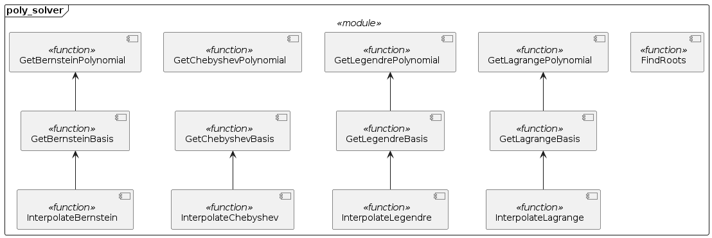
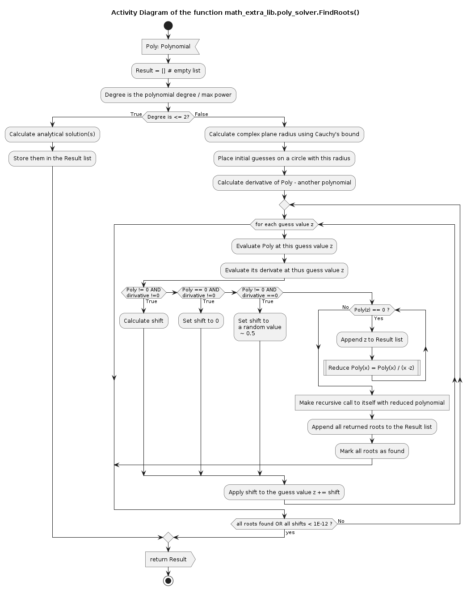
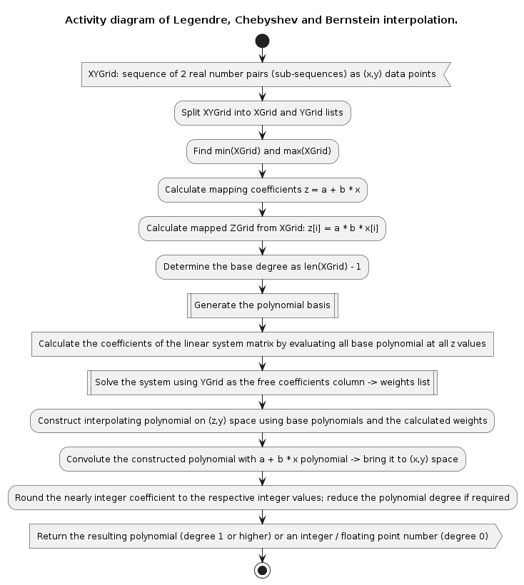

# Module math_extra_lib.poly_solver Reference

## Scope

This document describes the intended usage, design and implementation of the functionality implemented in the module **poly_solver** of the library **math\_extra\__lib**. The API reference is also provided.

The concerted functional elements are functions:

* *FindRoots*
* *GetLagrangePolynomial*
* *GetLagrangeBasis*
* *InterpolateLagrange*
* *GetLegendrePolynomial*
* *GetLegendreBasis*
* *InterpolateLegendre*
* *GetChebyshevPolynomial*
* *GetChebyshevBasis*
* *InterpolateChebyshev*
* *GetBernsteinPolynomial*
* *GetBernsteinBasis*
* *InterpolateBernstein*

## Intended Use and Functionality

The main purpose of this module is to enable:

* Calculation of the (complex) roots of an arbitrary polynomial with real coefficients, and
* Polynomial interpolation of a univariate function on the real numbers field

Polynomial of the degree *N* is a univarite function, which is a weighted sum of the non-negative integer powers of its variable, i.e. $P_N(x) = a_0 + a_1*x + \dots + a_N*x^N = \sum_{i=0}^N{a_i*x^i} \; : \; a_N \neq 0$. With all coefficients being real numbers this function evaluates to a real number of the real numbers field of its variable, i.e. $P_N(x) \in \mathbb{R}\;\forall\;x\in\mathbb{R}$ if $a_i \in \mathbb{R} \; \forall \; i$. The roots of a polynomial are the values of the variable at which the polynomial evaluates to zero, i.e. $x_i:P_N(x_i)=0$, which are the solutions of the equation $a_0 + a_1*x + \dots + a_N*x^N = 0$. There are known analytical solutions for the degrees 1, 2 and 3, although for the degree 3 there is no single form expression but several different forms depending on the relations between the coefficients. For the higher degrees there is no generic analytical solution.

Howevere, on the complex numbers field any real coefficients polynomial can be factorized as $P_N(x) = \sum_{i=0}^N{a_i*x^i} = a_N * \prod_j{(x-z_j)^{\mu_j}}$, where $z_j$ is a unique complex root value, $\mu_j \ge 1 \; \forall \; j$ is the multiplicity of the root, and $\sum_j{\mu_j} = N$. Hence, on the complex numbers fields any real polynomial of degree *N* has exactly *N* roots (accounting for the multiplicity), although not all roots are unique (single); some roots may be multiple, i.e. they appear more than once.

For instance, consider an equation $x^3 + 2 x^2 +2x+1=(x^2+x+1)(x+1)=0$. This equation has the analytical solution $\{-1, -\frac{1}{2} - \frac{\sqrt{3}}{2}, -\frac{1}{2} + \frac{\sqrt{3}}{2}\}$, however it might not be obvious for an unexperienced person. Hence, one can use numerical method implemented in this library

```python
from math_extra_lib.poly_solver import Polynomial, FindRoots

Problem = Polynomial(1, 2, 2, 1) #from the zero-th power to the N-th
print(f'Problem is {Problem}=0')
# >> Problem is x**3+2*x**2+2*x+1=0

Solution = FindRoots(Problem)
print(f'Solution (roots) is {Solution}')
# >> Solution (roots) is [-1, (-0.5000000000000001+0.8660254037844385j), (-0.5-0.8660254037844386j)]
```

For a univariate real function $f(x)$ evaluating to $y_i=f(x_i)$ at *N* distinct points $\{x_i\}$ a polynomial interpolation $P_M(x)$ is a polynomial of the degee $M \le N-1$, which evaluates to exactly the same values at the respective x-values, i.e. $P_M(x_i)=y_i=f(x_i) \; \forall \; i$. The fundamental statement is that for *N* distinct points $\{x_i\}$ (i.e. $x_i \neq x_j \; \forall \; i \neq j \in \{1, 2, \dots, N\}$) there is one and only one polynomial of the degree $N-1$ or lower, which graph goes through all points $\{(x_i, y_i)\}$. Such a polynomial can be found directly by solving a system of linear equations reqarding its coefficients, or it can be constructed as a weighted sum (linear composition) of the base polynomials (see [DE004](../Design/DE004_poly_solver.md)). Either of the approches should yield the same polynomial in theory, with the inifinite precision of the calculations. In practice, due to the rounding error of the finite precision of the numerical calculations (double precision floating point) the calculated coefficients of the interpolating polynomial may differ slightly depending on the shape of the function and the chosen method.

The first method, the direct calculation of the coefficients is not implemented in this module, since this functionality is already covered by the *math\_extra\_lib.matrix\_solver* module, as it is shown in the example below

```python
from math_extra_lib.matrix_solver import SolveLinearSystem
from math_extra_lib.polynomial import Polynomial

XGrid = [1, 2, 3]
YGrid = [2, 1, 3] #sample (x,y) values

Weights = [[pow(x, n) for n in range(3)] for x in XGrid]

Coefficients = SolveLinearSystem(Weights, YGrid)

Solution = Polynomial(*Coefficients)
```

In this module the second approach (using the base polynomials) is implemented, with 4 different bases available: Lagrange, Legendre, Chebyshev (of the 1st kind) and Bernstein polynomials. There are two reasons for inclusion of these four bases: a) the above mentioned finite precision of the calculations, depending on the function being interpolated some basis may yield more accurate results than others, and b) those polynomials are often encountered in other mathematical problems, specifically - solution of the differential equations; thus their generation is the additional value functionality of this module and the entire library. Considering the Legendre basis the same problem as above can be solved as

```python
from math_extra_lib.poly_solver import InterpolateLegendre

XGrid = [1, 2, 3]
YGrid = [2, 1, 3] #sample (x,y) values

XYGrid = zip(XGrid, YGrid)

Solution = InterpolateLegendre(XYGrid)
```

## Design and Implementation

The components diagram of the module is shown below



The function *FindRoots* uses a modified Alberth method (see [DE004](../Design/DE004_poly_solver.md)), such as

* If the passed polynomial is of the degree 2 or 1, the analytical solution is used
* For the higher degrees the numerical Alberth method is applied
  * The initial quesses are disributed uniformly in the complex numbers plane along the circumference of a circle with the radius equal to the Cauchy's bound
  * The displacement (shift) for each guess is calculated as:
    * If the derivative of the polynomial is zero but the polynomial itself is not zero at the guess point - i.e local extremum, but not a root, the displacement is genereated as a random number
    * If the derivative of the polynomial is not zero but the polynomial itself is zero at the guess point - i.e. single root is found, the displacement is set to zero
    * If the derivative of the polynomial is not zero and the polynomial itself is not zero at the guess point - the displacement is calcualted according to the Alberth formula
    * If the derivative of the polynomial is zero and the polynomial itself is zero at the guess point $z_i$ - i.e. multiple root, the polynomial is reduced in the degree by repeatitive division by $x-z_i$ until the resulting polynomial does not evaluate to zero at the same point $z_i$. The roots of the resulting reduced polynomial are found using recursive call to the function
* The iterations stop when either all roots are found using recursion, or all calculated displacements are less than a threshold value (~$10^{-12}$) by the absolute value
* The found roots are rounded and converted into real numbers if required:
  * If the imaginary part is less than a threshold value (~$10^{-12}$) by the absolute value the found root is converted into a real number
  * The real and imaginary parts are rounded to the nearest integer value if the absolute difference with it is less than a threshold value (~$10^{-12}$)
* The length of the returned list of the found roots always equals the degree of the polynomial, where multiple roots are included several times according to their multiplicity



Since the class **math\_extra\_lib.polynomial.Polynomial** is designed to support only real number coefficients and real number agrument, the polynomial evaluation, calculation of a derivative and division by another polynomial functionality is re-implemented as 'private' helper functions in the module.

All other 'public' functions in the module belong to one of the following 3 groups:

* Generation of a single base polynomial, e.g. Legendre polynomial of a specific degree - *GetLegendrePolynomial*()
* Generation of the complete polynomial basis, e.g. Legendre polynomials of the degrees 0 to N - *GetLegendreBasis*()
* Interpolation of a function presented by a set of $\{(x_i,y_i)\}$ values using a specific polynomial basis, e.g. *InterpolateLegendre*()

Note, that all $x_i$ values must be unique, although neither equidistant distribution of the x-nodes nor the ordering of the x-values is required.

In the case of the Lagrange polynomials each individual base polynomial is constructed from its roots (x values, at which it must evaluate tozero) directly using the *Polynomial.fromRoots*() method and then divided by its value at the node (x value, at which it evaluates to 1). The complete basis is created by iterating all provided x-grid values and using the current x value as the node, and the rest of the values in the sequence as the roots. The interpolating polynomial is constructed as a linear composition of all base polynomials weighted by the y-value at the corresponding x-value (node of this particular base polynomial).

With the other 3 bases the algorithm is different. An individual Legendre or Bernstein base polynomial is contructed directly using an analytical formula based on the (generalized) binomial coefficients, thus the functions *GetLegendreBasis*() and *GetBernsteinBasis*() utilize the functions *GetLegendrePolynomial*() and *GetBernsteinPolynomial*() respectively to construct the complete basis. In the case of the Chebyshev polynomials of the first kind the recursive formula is simpler and faster since it relies only on the interger multiplication; thus the function *GetChebyshevBasis*() function does not call the *GetChebyshevPolynomial*() function, but re-implements the same calculation algorithm, whilst storing the intermediate steps (already calculated polynomials of the lower degrees).

Also, the Legendre and Chebyshev bases are defined on the interval [-1, 1] and on the interval [0, 1] for the Bernstein basis. Therefore, the corresponding interpolation functions, at first, define the linear mapping $\varepsilon_i = a + b * x_i$, which maps $\min(x_i)$ and $\max(x_i)$ onto the respective definition intervals. The complete basis is constructed based on the number of the data points. Each j-th base polynomial $P^{(j)}(\varepsilon)$ is evaluated at each i-th data point $\varepsilon_i$, and the weighting coefficients $a_j$ are calculated from the requirement $\sum_{j=1}^N{a_j*P^{(j)}(\varepsilon_i)} = y_i \; \forall \; i \in [1, N]$, which produces a system of N linear equations for N varibles. The interpolating polynomial in the $(\varepsilon, y)$ coordinates is constructed as $P(\varepsilon) = \sum_{j=1}^N{a_j * P^{(j)}(\varepsilon)}$, which is then transformed into $(x,y)$ coordinates by convolution with $a+b*x$ polynomial, i.e. $P(\varepsilon) \rightarrow \hat{P}(x) \; : \; \hat{P}(x) = P(a+b*x)$.

Finally, with all 4 bases the coefficients of the calculated polynomial are rounded to the nearest integer values, if the absolute difference does not exceed the threshold value (~ $10^{-12}$). The degree of the polynomial is reduced respectively if the highest degrees coefficients are set to zero. This approach reduces the artificial oscillations of the interpolating polynomial function due to rounding errors in the calculations in the cases when the actual function being interpolated itself is a low degree polynomial (lower than number of points - 1), or it is smooth enough to be well approximated by such a polynomial. **Note** that this simple precaution may not work properly if $Var(y) \gg Var(x)$ (ineffective oscillations suppession), and it may misfire if $Var(y) \ll Var(x)$ resulting in too low degree polynomial not properly following the data points. Consider X- or Y-axis rescaling before the interpolation in such cases.



## API Reference

### Functions

**FindRoots**(Poly)

*Signature*:

Polynomial -> list(int OR float OR complex)

*Args*:

*Poly*: **Polynomial**; instance of the class, the polynomial, which roots are to be found

*Returns*:

**list**(**int** OR **float** OR **complex**): the found roots of the polynomial

*Raises*:

**UT_TypeError**: argument is not an instance of Polynomial class

*Description*:

Calculates all roots of a polynomial passed as an instance of **Polynomial** class using Alberth method, and returns them as a list of real or complex numbers. Each root with multiplicity K is included exactly K times; thus for a polynomial of the degree N the length of the list is exactly N.

**GetLagrangePolynomial**(Node, Roots)

*Signature*:

int OR float, seq(int OR float) -> Polynomial

*Args*:

* *Node*: **int** OR **float**; the x-value, at which the polynomial evaluates to 1
* *Roots*: **seq**(**int** OR **float**); sequence of real numbers (x-values), at which the polynomial evaluates to 0

*Returns*:

**Polynomial**: instance of, a polynomial of degree N, where N is the number of the roots

*Raises*:

* **UT_TypeError**: the first argument is not a real number, OR the second argument is not a sequence of real numbers
* **UT_ValueError**: roots sequence is empty, OR it contains, at least, 2 equal elements

*Description*:

Calculates a single base Lagrange polynomial, which evaluates to 1 at the provided node x-value and to 0 at all passed N roots (x-values).

**GetLagrangeBasis**(XGrid)

*Signature*:

seq(int OR float) -> list(Polynomial)

*Args*:

*XGrid*: **seq**(**int** OR **float**); sequence of unique real numbers

*Returns*:

**list**(**Polynomial**): list of N instances of Polynomial class - the base Lagrange polynomials - each of the degree N-1, where N is the number of points

*Raises*:

* **UT_TypeError**: the passed argument is not a sequence of real numbers
* **UT_ValueError**: the passed sequence contains less than 2 elements, OR, at least, two elements are equal

*Description*:

Calculates N base Lagrange base polynomials of the degree N-1 for the passed N unique x-values (nodes).

**InterpolateLagrange**(XYGrid)

*Signature*:

seq(seq(int OR float, int OR float)) -> Polynomial OR int OR float

*Args*:

*XYGrid*: **seq**(**seq**(**int** OR **float**, **int** OR **float**)); a sequence of 2-elements sub-sequences of real numbers, representing the X-Y values pairs of the function to be interpolated

*Returns*:

* **Polynomial**: instance of, interpolating polynomial of degree 1 or higher
* **int** OR **float**: interpolating function is constant (0-th degree)

*Raises*:

* **UT_TypeError**: the passed argument is not a sequence, OR any of its elements is not a sequence (nested) of real numbers (int or float), OR a length of any of the sub-sequence is not 2
* **UT_ValueError**: the passed argument is empty or contains only 1 element, OR any of the X values is not unique (first element of the sub-sequences)

*Description*:

Calculates an interpolatig polynomial of degree <= N - 1, where N is the number of (X,Y) data points provided. The calculated polynomial goes (almost) exactly through each of the provided data points. A constant function (0-th degree polynomial) is represented by a real number, higher degrees - by an instance of the **math\_extra\_lib.polynomial.Polynomial** class. Lagrange polynomial basis is used in the calculations.

**GetLegendrePolynomial**(Degree)

*Signature*:

int >= 0 -> Polynomial OR int

*Args*:

*Degree*: **int** >= 0; the requested degree of the polynomial

*Returns*:

* **Polynomial**: instance of, degree > 0
* **int**: value = 1, degree is 0

*Raises*:

* **UT_TypeError**: the passed argument is not an integer number
* **UT_ValueError**: the passed argument is a negative integer number

*Description*:

Calculates a single Legendre polynomial of degree N >= 0.

**GetLegendreBasis**(Degree)

*Signature*:

int >= 0 -> list(Polynomial OR int)

*Args*:

*Degree*: **int** >= 0; the requested degree of the basis

*Returns*:

**list**(**Polynomial** OR **int**): the basis, where the first element is always 1, and each subsequent element is an instance of polynomial class of the degree equal to the element index

*Raises*:

* **UT_TypeError**: the passed argument is not an integer number
* **UT_ValueError**: the passed argument is a negative integer number

*Description*:

Calculates a complete Legendre polynomial base of degree N >= 0.

**InterpolateLegendre**(XYGrid)

*Signature*:

seq(seq(int OR float, int OR float)) -> Polynomial OR int OR float

*Args*:

*XYGrid*: **seq**(**seq**(**int** OR **float**, **int** OR **float**)); a sequence of 2-elements sub-sequences of real numbers, representing the X-Y values pairs of the function to be interpolated

*Returns*:

* **Polynomial**: instance of, interpolating polynomial of degree 1 or higher
* **int** OR **float**: interpolating function is constant (0-th degree)

*Raises*:

* **UT_TypeError**: the passed argument is not a sequence, OR any of its elements is not a sequence (nested) of real numbers (int or float), OR a length of any of the sub-sequence is not 2
* **UT_ValueError**: the passed argument is empty or contains only 1 element, OR any of the X values is not unique (first element of the sub-sequences)

*Description*:

Calculates an interpolatig polynomial of degree <= N - 1, where N is the number of (X,Y) data points provided. The calculated polynomial goes (almost) exactly through each of the provided data points. A constant function (0-th degree polynomial) is represented by a real number, higher degrees - by an instance of the **math\_extra\_lib.polynomial.Polynomial** class. Legendre polynomial basis is used in the calculations.

**GetChebyshevPolynomial**(Degree)

*Signature*:

int >= 0 -> Polynomial OR int

*Args*:

*Degree*: **int** >= 0; the requested degree of the basis

*Returns*:

* **Polynomial**: instance of, degree > 0
* **int**: value = 1, degree is 0

*Raises*:

* **UT_TypeError**: the passed argument is not an integer number
* **UT_ValueError**: the passed argument is a negative integer number

*Description*:

Calculates a single Chebyshev polynomial (of the 1st kind) of degree N >= 0.

**GetChebyshevBasis**(Degree)

*Signature*:

int >= 0 -> list(Polynomial OR int)

*Args*:

*Degree*: **int** >= 0; the requested degree of the basis

*Returns*:

**list**(**Polynomial** OR **int**): the basis, where the first element is always 1, and each subsequent element is an instance of polynomial class of the degree equal to the element index

*Raises*:

* **UT_TypeError**: the passed argument is not an integer number
* **UT_ValueError**: the passed argument is a negative integer number

*Description*:

Calculates a complete Chebyshev polynomial base of degree N >= 0 (of the 1st kind).

**InterpolateChebyshev**(XYGrid)

*Signature*:

seq(seq(int OR float, int OR float)) -> Polynomial OR int OR float

*Args*:

*XYGrid*: **seq**(**seq**(**int** OR **float**, **int** OR **float**)); a sequence of 2-elements sub-sequences of real numbers, representing the X-Y values pairs of the function to be interpolated

*Returns*:

* **Polynomial**: instance of, interpolating polynomial of degree 1 or higher
* **int** OR **float**: interpolating function is constant (0-th degree)

*Raises*:

* **UT_TypeError**: the passed argument is not a sequence, OR any of its elements is not a sequence (nested) of real numbers (int or float), OR a length of any of the sub-sequence is not 2
* **UT_ValueError**: the passed argument is empty or contains only 1 element, OR any of the X values is not unique (first element of the sub-sequences)

*Description*:

Calculates an interpolatig polynomial of degree <= N - 1, where N is the number of (X,Y) data points provided. The calculated polynomial goes (almost) exactly through each of the provided data points. A constant function (0-th degree polynomial) is represented by a real number, higher degrees - by an instance of the **math\_extra\_lib.polynomial.Polynomial** class. Chebyshev polynomial basis (of the first kind) is used in the calculations.

**GetBernsteinPolynomial**(Degree, Index)

*Signature*:

int >= 0, int >= 0 -> Polynomial OR int

*Args*:

*Degree*: **int** >= 0; the requested degree of the polynomial (basis degree)
*Index*: **int** >= 0; the requested index of the polynomial whithin the basis

*Returns*:

* **Polynomial**: instance of, degree > 0
* **int**: value = 1, degree is 0

*Raises*:

* **UT_TypeError**: the first passed argument is not an integer number, OR the second passed argument is not an integer number
* **UT_ValueError**: the first passed argument is a negative integer number, OR the second passed argument is not an integer number, OR the second argument is larger than the first

*Description*:

Calculates a single Bernstein polynomial of degree N >= 0 and index K, where 0 <= K <= N.

**GetBernsteinBasis**(Degree)

*Signature*:

int >= 0 -> list(Polynomial) OR list(int)

*Args*:

*Degree*: **int** >= 0; the requested degree of the basis

*Returns*:

**list**(**Polynomial** OR **int**): the basis, for the *Degree* = 0 it is [1], otherwise it contains N = *Degree* **Polynomial**-class instances, each being a polynomial of degree = *Degree*

*Raises*:

* **UT_TypeError**: the passed argument is not an integer number
* **UT_ValueError**: the passed argument is a negative integer number

*Description*:

Calculates a complete Bernstein polynomial base of degree N >= 0.

**InterpolateBernstein**(XYGrid)

*Signature*:

seq(seq(int OR float, int OR float)) -> Polynomial OR int OR float

*Args*:

*XYGrid*: **seq**(**seq**(**int** OR **float**, **int** OR **float**)); a sequence of 2-elements sub-sequences of real numbers, representing the X-Y values pairs of the function to be interpolated

*Returns*:

* **Polynomial**: instance of, interpolating polynomial of degree 1 or higher
* **int** OR **float**: interpolating function is constant (0-th degree)

*Raises*:

* **UT_TypeError**: the passed argument is not a sequence, OR any of its elements is not a sequence (nested) of real numbers (int or float), OR a length of any of the sub-sequence is not 2
* **UT_ValueError**: the passed argument is empty or contains only 1 element, OR any of the X values is not unique (first element of the sub-sequences)

*Description*:

Calculates an interpolatig polynomial of degree <= N - 1, where N is the number of (X,Y) data points provided. The calculated polynomial goes (almost) exactly through each of the provided data points. A constant function (0-th degree polynomial) is represented by a real number, higher degrees - by an instance of the **math\_extra\_lib.polynomial.Polynomial** class. Legendre polynomial basis is used in the calculations.
