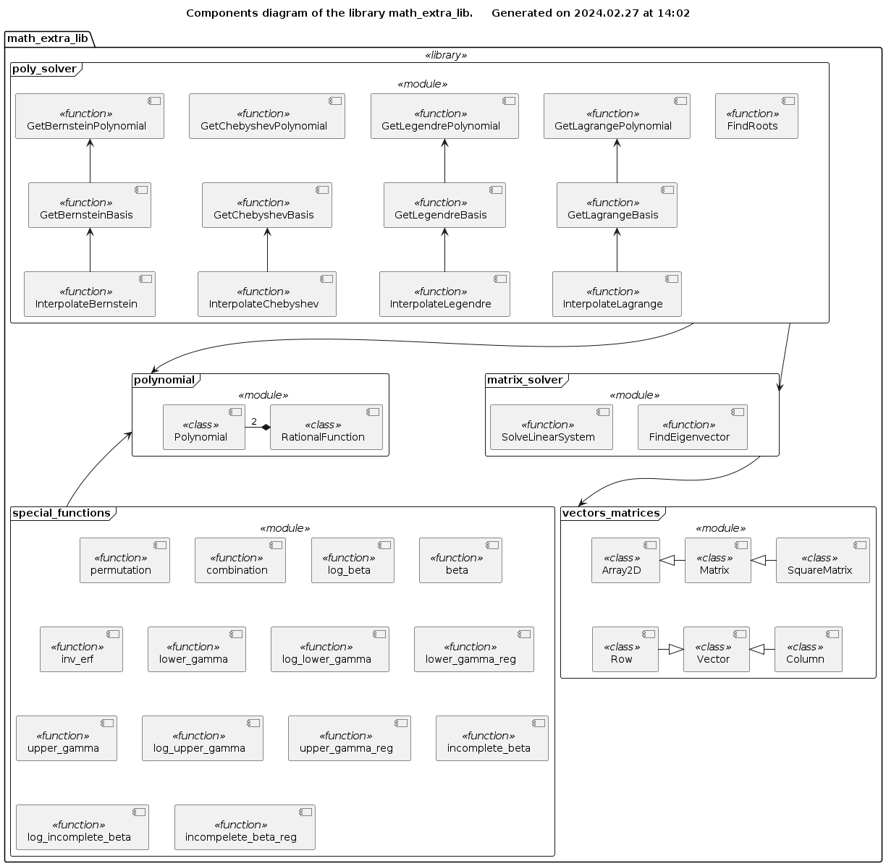

# Library math\_extra\_lib

## Purpose

The purpose of this library is to provide the necessary tools for the numerical methods in the fields related to the *linear algebra*, *statistical analysis*, *regression data fitting* and *signal processing*. This is a *light-weight pure Python code* replacement for NumPy / SciPy in the situations when only a limited, specific functionality is required, and the calculation speed is not an issue.

The library includes a number of classes and functions implementing the following functionality:

* Special mathematical functions (beta, gamma, standard error function, etc.) commonly used in the statistical analysis (continuous distributions)
* Polynomial evaluation and arithmetics on the field of the *rational* numbers (only integer and floating point types are supported)
* Finding all *complex* roots of a polynomial with the *rational* coefficients
* Polynomial interpolation of a real function of a single real argument (only integer and floating point types are supported)
* Construction of an orthogonal polynomial basis (Legendre, Chebyshev of the first kind, Bernstein)
* Matrix and vectors (row and column) arithmetics on the field of the rational numbers (only integer and floating point types are supported)
* Calculation of the trace, the determinant, the inverse matrix, the LUP and LDUP decomposition, and the *real* eigenvalues / eigenvectors of a square matrix
* Solution of a system of linear equations

## Installation

Clone the official repository into your local workspace / project folder:

```bash
$git clone <repository_path> "your projects folder"/math_extra_lib
```

Check the system requirements and dependencies:

```bash
$cd "your projects folder"/math_extra_lib
$python3 ./check_dependencies.py
```

### For developers only

Initialize the UML templates submodule

```bash
$cd "your projects folder"/math_extra_lib/Documentation/UML/Templates
$git submodule init
```

Download the content of the UML templates submodule

```bash
$git submodule update --recursive --remote
```

## System requirements

This library is written in Python 3 programming language (>= v3.6) and is intended to be OS platform independent. At least, it is tested under MS Windows and GNU Linux OSes, see [Documentation/Tests/tested_OS.md](./Documentation/Tests/tested_OS.md).

This library depends on the Python library **introspection\_lib** (see [Dependencies.md](./Dependencies.md)).

## Library structure



## Documentation

All documentation on the library is written in Markdown format, see the [index list](./Documentation/index.md).

* [Requirements](./Documentation/Requirements/index.md)
* [Design](./Documentation/Design/index.md)
* [Tests](./Documentation/Tests/index.md)
* [User and API References](./Documentation/References/index.md)
